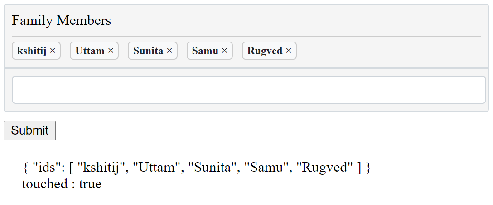

# ksh-list-input

This is a custom form control which accepts/validates list of values separated by comma



## Versions:

-   Version **1.x** works with **Angular 10.x and above**.
-   Requires jQuery

## Installation

```shell
npm install ksh-list-input

```
## How to use example
Once installed you need to import our module:

```js
...
import { KshListInputModule } from 'ksh-list-input';

@NgModule({
  declarations: [
    AppComponent
  ],
  imports: [
    ...
    BrowserModule,
    ReactiveFormsModule,
    KshListInputModule
  ],
  providers: [],
  bootstrap: [AppComponent]
})
export class AppModule { }
```

```js
export class AppComponent {
  form: FormGroup;
  opts: KInputOptions;

  constructor(private _fb: FormBuilder) {
    this.form = this._fb.group({
      ids: [[ 'kshitij', 'Uttam', 'Sunita', 'Samu', 'Rugved' ]]
    });

    this.opts = {
      maxHeight: 100,
      regexp: null,  //Regular expression to validate. default null
      valueLabel: 'Names' //Name of the field
    };
  }
}
```

If you want to validate input values then add RegExp to regexp in options and every input will be validated

```html
<form [formGroup]="form" (ngSubmit)="submit()" novalidate autocomplete="off">
  <ksh-list-input formControlName="ids" [options]="opts"></ksh-list-input>
  <button type="submit" class="btn btn-primary" style="margin-top: 10px;">Submit</button>
</form>

<div style="margin: 20px;">
  <label>{{ form.value | json }}</label>
  <label>touched : {{ ids.touched | json }}</label>
</div>
```

## License
MIT License


